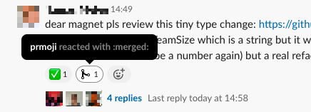

# prmoji

A tiny web service that puts emojis on your Slack message when your PR is
approved, commented etc.



## How does it work?

If you invite the `prmoji` bot to your channel, it'll start listening to your
messages. Whenever someone posts a GitHub pull request URL, `prmoji` saves that
into the database (URL, message channel, message timestamp).

## Setup

### Database

You'll need a PostgreSQL database with the following table:

```
                                            Table "public.pr_messages"
      Column       |            Type             | Collation | Nullable |                 Default
-------------------+-----------------------------+-----------+----------+-----------------------------------------
 id                | smallint                    |           | not null | nextval('pr_messages_id_seq'::regclass)
 inserted_at       | timestamp without time zone |           |          | now()
 pr_url            | character varying           |           | not null |
 message_channel   | character varying           |           |          |
 message_timestamp | character varying           |           |          |
Indexes:
    "pr_messages_pkey" PRIMARY KEY, btree (id)
```

### Service

Requirements: Node 12\
Setup: `yarn`\
Run: `yarn start`\
Optionally you can specify the log level with `yarn start -- --loglevel=X` where
X is one of`: silent, error, info, debug, silly. (Default is info.)

You'll have to expose the following env vars:\
`SLACK_TOKEN` - for communicating with Slack\
`DATABASE_URL` - the PostgreSQL DB URL including credentials

### Slack

Note: this only has to be done once.

- Go to https://api.slack.com/apps/
- Click Your apps
- Click Create New App
- Enter "prmoji" and select your workspace
- On the next page, under Add features and functionality
- Select Event subscriptions
- Click Enable Events
- Add https://prmoji.herokuapp.com/event/slack as the URL
- Navigate to Bot Users
- Click Add a Bot User, then without changing anything click the Add a Bot User
  below the form
- Navigate back to Event Subscriptions
- Click Enable Events
- Fill out the URL with the same value as above
- Under Subscribe to bot events, select `message.channels` and `message.groups`
- Click Install App
- Click Add app to your workspace
- Copy the Bot access token and expose it for the service as an env var called
  `SLACK_TOKEN`

### GitHub

Note: this has to be done for every repository you wish to watch.

- Go to https://github.com/YOUR-USER/YOUR-REPO/settings/hooks
- Click Add webhook
- Add https://prmoji.herokuapp.com/event/github as the URL
- Change the content type to application/json
- Click Let me select individual events
- Tick Issue comments, Pull requests, Pull request reviews, and Pull request
  review comments
- Click Add webhook
